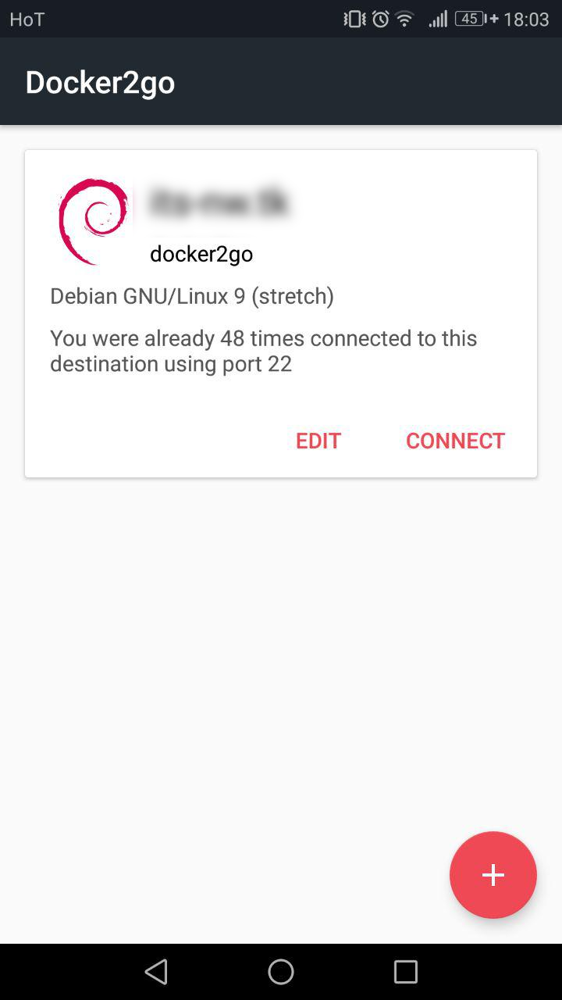
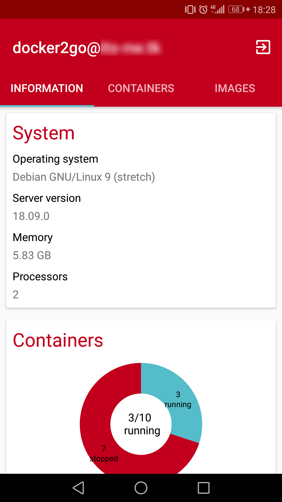
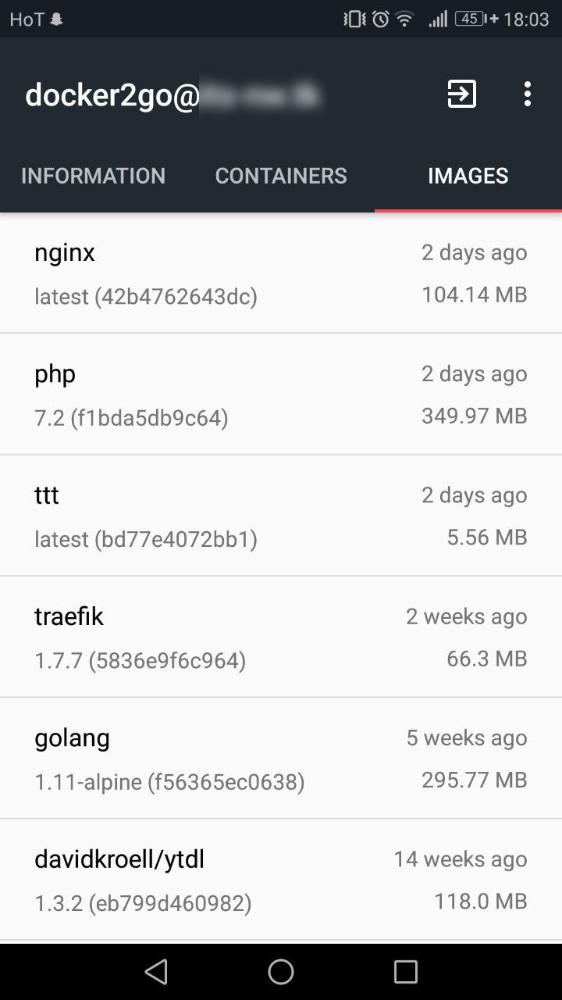
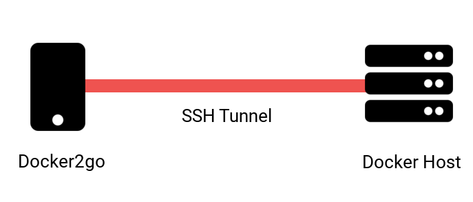

# Overview
Docker2go is an app for Android devices which allows you to manage your Docker Host on the go.
The application (of course) does not cover the full functionality of Docker.

Feel free to contribute. More in section [Contributing](#contributing)

## Screenshots

## Concept
Docker2go leverages Dockers unix socket to talk to it's JSON API. The application connects through a SSH tunnel to the remote Host. 

> The SSH tunnel is created with the third party library JSch. 

Then, the app does execute a `curl` command over the CLI. 
Docker2go uses Dockers HTTP API which is based on JSON. 
The output of the API (JSON formatted) is then parsed using Googles `gson` Library to use it as Java objects.

This concept diagram gives an idea how the application works. 

## Features
The app currently provides the following funcionalities:

**Connections** are displayed when Docker2go is started.
It diplays all saved connection as Cards which includes operating system's logo as profile picture

- Add connection to a remote host
- Edit a connection
- Delete a connection

**Basic information** is showed when a connection to a remote host is initiated
Connecting to a remote host does perform a static host key check.

- Operating System
- Server version (Docker daemon version)
- Memory and CPU
- Overview of running and stopped containers (pie chart)
- Swarm mode (if enabled)

**Containers** are printed out in a list where the following information gets displayed

- Name
- Status (running/stopped/exit code)
- Created time
- Image (gets showed on click)
- Port mappings

By clicking on a container actions depending on container state may be taken

- Inspect
- Restart (if running)
- Start (if stopped/paused)
- Stop (if running)
- Remove

Inspecting a container gives more detailed information about the desired container.

**Images** are printed out in a list where the following information gets displayed

- Name
- Tag with shortened SHA
- Created time
- Size

**Actions**

- Pull Image
- Prune Images

## Third party libraries
Docker2go uses several third party libraries.
Every used library is listed below with notes about the specific use case.

| Library Name                                                | Version | License    | Use case                                                     |
| ----------------------------------------------------------- | ------- | ---------- | ------------------------------------------------------------ |
| [JSch](http://www.jcraft.com/jsch/)                         | 0.1.54  | BSD-style  | Used to create secure tunnel to the remote Docker host.      |
| [SugarORM](https://github.com/chennaione/sugar)             | 1.4     | MIT        | Used to store connection data (Hostname, User, Port, ...)    |
| [Gson](https://github.com/google/gson)                      | 2.8.0   | Apache-2.0 | Used to parse JSON calls to Java Objects                     |
| [MPAndroidChart](https://github.com/PhilJay/MPAndroidChart) | 2.2.4   | Apache-2.0 | Used to draw charts (running/stopped container chart) |

## Contributing
If you find a bug, have a question want a feature, etc. drop an issue in the project [issue tracker](https://github.com/davidkroell/docker2go/issues).

Of course you may also submit a pull request which already fixes a bug or adds a feature.
Just make sure it is well tested and maybe also documented.

For this, use GitHubs fork mechanism.
